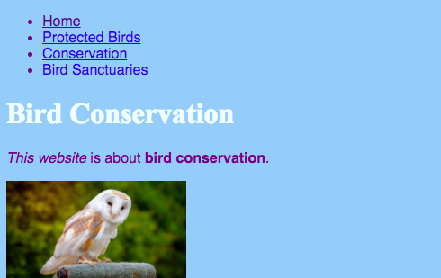
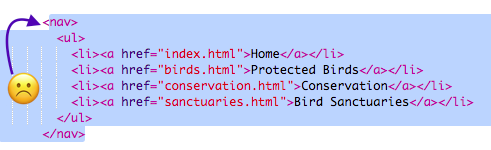
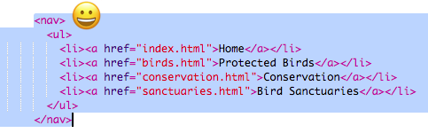

## अपनी वेबसाइट को नेविगेट(navigate) करना

कई वेबसाइटों में आगंतुकों(हमारी वेबसाइट के उपयोगकर्ता) को पृष्ठों के बीच ले जाने में मदद करने के लिए **नेविगेशन(navigation)** मेनू होता है। अब जब आपको पृष्ठों का एक समूह, एक मुखपृष्ठ और प्रत्येक पृष्ठ के लिंक मिल गए हैं, तो प्रत्येक पृष्ठ के शीर्ष पर एक नेविगेशन अनुभाग(section) से लिंक की सूची को स्थानांतरित करें।



- आपके द्वारा पिछले चरण में बनाई गई लिंक्स की सूची के कोड को खोजें।

- खुलने वाले `<ul>` टैग से ठीक पहले, **Enter** दबाकर एक नई रिक्त पंक्ति दर्ज करें, फिर नई पंक्ति पर निम्न टैग टाइप करें: `<nav>`। Trinket स्वतः समापन टैग को इसके ठीक बाद जोड़ता है, लेकिन आप इसे हटा सकते हैं - यह सही जगह पर नहीं है।

- समापन वाले `</ul>` टैग के ठीक **बाद**, **enter** दबकर एक नई रिक्त पंक्ति दर्ज करें, और वहाँ समापन टैग `</nav>` टाइप करें।

- अब खुलने वाले `<nav>` से ठीक पहले क्लिक कर बंद होने वाले `</nav>` टैग के ठीक बाद तक माउस को नीचे खींच करके अपने संपूर्ण `<nav>` अनुभाग(section) और सूची का चयन करें, ताकि खुलने और बंद होने के टैग सहित सभी पाठ(text) उभर जाएं। यह सुनिश्चित करें की सभी प्रारंभ और अंत वाले **कोण कोष्ठक(angle brackets)** `<` और `>` भी उभरे हुए हैं!

 


- आप इस बार प्रतिलिपि के बजाय **कट** करने जा रहे हैं। <kbd>Ctrl</kbd> (या <kbd>cmd</kbd>) कुंजी दबाए रखें, और इसे पकड़ते समय, <kbd>X</kbd> दबाएं। उभरा हुआ कोड गायब हो जाएगा, लेकिन घबराएं नहीं!

- फ़ाइल के शीर्ष पर, `<header> </header>` टैग के बीच क्लिक करें। सुनिश्चित करें कि आप वहां कर्सर(cursor) झपकता हुआ देख पा रहे हैं। अब <kbd>Ctrl</kbd> (या <kbd>cmd</kbd>) और <kbd>V</kbd> दबाकर हमेशा की तरह कोड पेस्ट(paste) करें। आपका कोड कुछ इस तरह दिखना चाहिए:

```html
    <header>
        <nav>
            <ul>
                <li><a href="index.html">Home</a></li>
                <li><a href="birds.html">Protected Birds</a></li>
                <li><a href="conservation.html">Conservation</a></li>
                <li><a href="sanctuaries.html">Bird Sanctuaries</a></li>
            </ul>
        </nav>
    </header>
```

--- collapse ---
---
title: पूर्ववत(undo) करें!
---

यदि आप कोई गलती करते हैं, तो आप <kbd>Ctrl</kbd> (या <kbd>cmd</kbd>) और <kbd>Z</kbd> साथ में दबाकर **पूर्ववत(undo)** कर सकते हैं। पिछले कुछ परिवर्तनों को पूर्ववत(undo) करने के लिए आप आमतौर पर इस कुंजी संयोजन(combination) को कुछ बार दबा सकते हैं। यह एक और उपयोगी कीबोर्ड शॉर्टकट है जिसे आप कई प्रोग्रामों में उपयोग कर सकते हैं!

--- /collapse ---

- यह सुनिश्चित करने के लिए आपके लिंक अभी भी काम कर रहे हैं, उन्हें आज़माएं ।

--- challenge ---

## चुनौती: सभी पृष्ठों के लिए नेविगेशन मेनू

- इस कोड सेक्शन को आपके द्वारा बनाई गई प्रत्येक HTML फाइल के शीर्ष लेख(header section) में डालें। इससे नेविगेशन मेनू(navigation menu) आपकी वेबसाइट पर हर पृष्ठ के शीर्ष पर दिखाई देगा।

--- hints ---


--- hint ---

पहले की तरह पूरे `<nav>` अनुभाग का चयन करें और इसकी प्रतिलिपि बनाने के लिए <kbd>Ctrl</kbd> (या <kbd>cmd</kbd>) और <kbd>C</kbd> एक साथ दबाएं।

फिर,जैसा आपने पहले किया था ठीक उसी तरह, अपनी प्रत्येक `.html` फ़ाइल में, `<header> </header>` के अंदर क्लिक करें और कोड को पेस्ट करें।


--- /hint ---


--- /hints ---

अब आप चाहे आप जिस भी पृष्ठ पर हों, लिंक पर क्लिक कर पाएंगे ।

--- /challenge ---
