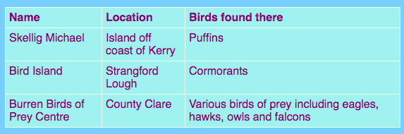

## एक तालिका जोड़ना

कभी-कभी तालिका में जानकारी दिखाना उपयोगी हो सकता है। उदाहरण के लिए, आप किसी स्थानीय स्पोर्ट्स क्लब या स्कूल के लिए वेबसाइट पर सदस्य जानकारी या अपने दस सबसे पसंदीदा गीतों के बारे में जानकारी सूचीबद्ध करना चाह सकते हैं।

एक तालिका एक ग्रिड है जो **पंक्तियों** और **स्तम्भों** से बना है। अधिकांश तालिकाओं में प्रत्येक स्तंभ के ऊपर शीर्षक भी शामिल होते हैं, जिन्हें **header** (हैडर (शीर्ष लेख)) कहा जाता है। यहाँ एक उदाहरण है:



- `page_with_table.html` फाइल पर जाएं। वहां आपको `<table> </table>` टैग के बीच कोड का एक समूह दिखाई देगा।

- शुरुआत के `<table>` टैग से अंत के `</table>` टैग तक सभी कोड का चयन करें और इसकी प्रतिलिपि बना लें। फिर अपनी किसी एक फाइल पर जाएं जहां आप एक तालिका बनाना चाहते हैं, और कोड में पेस्ट करें।

फिलहाल आपकी तालिका खाली है।

- अपनी पसंद की किसी भी चीज़ के साथ अपनी तालिका को भरने की कोशिश करें! बस `<td> </td>` टैग और `<th> </th>` टैग के बीच पाठ(text) डालें। जरूरत पड़ने पर आप और टैग जोड़ सकते हैं।

--- collapse ---
---
title: उदाहरण कोड
---

ऊपर दिखाई गई तालिका के लिए HTML कोड इस तरह दिखता है:

```html
  <table>
    <tr>
      <th>Name</th>
      <th>Location</th>
      <th>Birds found there</th>
    </tr>
    <tr>
      <td>Skellig Michael</td>
      <td>Island off coast of Kerry</td>
      <td>Puffins</td>
    </tr>
    <tr>
      <td>Bird Island</td>
      <td>Strangford Lough</td>
      <td>Cormorants</td>
    </tr>
    <tr>
      <td>Burren Birds of Prey Centre</td>
      <td>County Clare</td>
      <td>Various birds of prey including eagles, hawks, owls and falcons</td>
    </tr>
  </table>
```

--- /collapse ---

दूसरी **पंक्ति(row)** जोड़ने के लिए, का एक और `<tr> </tr>` टैग जोड़ें । उनके बीच में, आप समान(same) संख्या में **data** आइटम(item) `<td></td>` टैग के साथ डालें जितने की आपके द्वारा अन्य पंक्तियों में दिए गए।

एक और **स्तम्भ(column)** जोड़ने के लिए, एक अतिरिक्त **data** आइटम के साथ `<td> </td>` टैग के सेट **हर** पंक्ति(row) में जोड़ें। पहली पंक्ति में `<th> </th>` टैग का उपयोग करते हुए अतिरिक्त **header** भी जोड़ें।

--- collapse ---
---
title: यह कैसे काम करता है?
---

आइए उन सभी टैगों पर एक नजर डालते हैं। यह सूची के लिए कोड की तरह है (`<ul>` और `<ol>` याद रखें), लेकिन इसमें अधिक स्तर हैं।

प्रत्येक `<tr> </tr>` टैग की जोड़ी एक पंक्ति(row) है, इसलिए उनके बीच की सभी चीजें एक पंक्ति में प्रदर्शित की जाएंगी।

पहली पंक्ति में `<th> </th>` टैग शामिल हैं। ये हेडर(header) के लिए उपयोग किए जाते हैं, इसलिए स्तंभ(column) शीर्षक उनके बीच में जाते हैं। आपकी तालिका में प्रत्येक स्तंभ(column) के लिए एक जोड़ी है।

`<td> </td>` टैग टेबल डेटा को परिभाषित करते हैं, और यही सब अन्य पंक्तियों में जाता है। ये सूची आइटम टैग `<li> </li>` के समान हैं: उनके बीच का सब कुछ आपके तालिका की पंक्ति में एक वास्तु है।

--- /collapse ---

- यदि आप `styles.css` फ़ाइल के अंत को देखते हैं, आपको CSS कोड दिखाई देगा जो तालिका कैसे दिखनी चाहिए यह बताता है। आपको यह सब समझने की जरूरत नहीं है! लेकिन आप अपनी खुद की शैली डिजाइन करने के लिए पाठ(text), सीमा(border) और पृष्ठभूमि(background) के रंगों को बदलने के साथ प्रयोग कर सकते हैं।

```css
  table, th, td {
    border: 1px solid HoneyDew;
    border-collapse: collapse;
  }
  tr {
    background-color: PaleTurquoise;
  }
  th, td {
    vertical-align: top;
    padding: 5px;
    text-align: left;
  }
  th {
    color: purple;
  }
  td {
    color: purple;
  }
```

क्या आपने ध्यान दिया कि कुछ चयनकर्ता अल्पविराम का उपयोग कैसे करते हैं, उदाहरण के लिए `table, th, td`? यह **चयनकर्ताओं की सूची(list of selectors)** है: इसका मतलब है कि यह सभी `<th>` तत्वों(elements) और सभी `<td>` तत्वों(elements) पर लागू होता है। यह प्रत्येक चयनकर्ता के लिए नियमों के समान सेट को टाइप करने से बचाता है!


***
इस परियोजना का अनुवाद स्वयंसेवकों ने किया:

Jaspreet Singh

Ram Prasad

स्वयंसेवकों को धन्यवाद, हम दुनिया भर के लोगों को अपनी भाषा में सीखने का मौका दे सकते हैं। आप स्वेच्छा से अधिक लोगों तक पहुँचने में मदद कर सकते हैं - [rpf.io/translate](https://rpf.io/translate) पर अधिक जानकारी प्राप्त करें।
