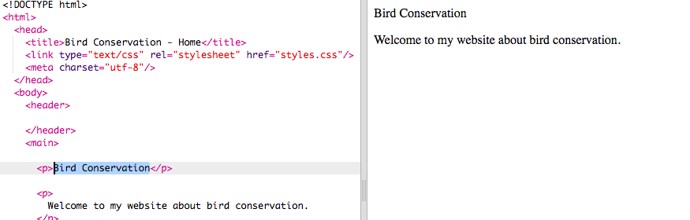
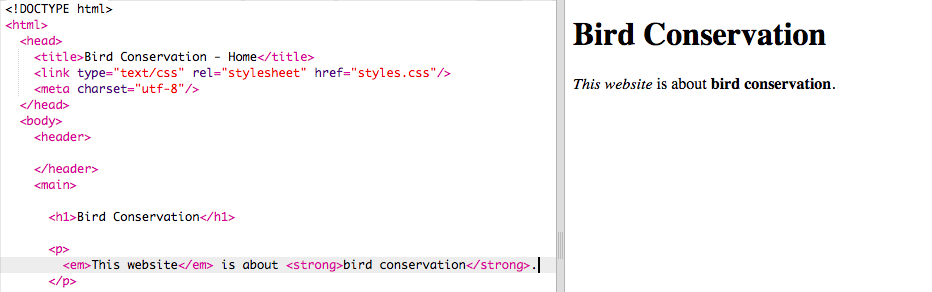

## आपका पहला वेबपेज!

- बायीं ओर के पैनल, जिसे **कोड पैनल(code panel)** कहा जाता है, उस में `index.html` टैब पर क्लिक करें।

- उस पंक्ति को खोजें जहाँ `Hello!` जहाँ लिखा है और इसे अपने संदेश में बदल दें - सावधान रहें टैग **नहीं** हटाएँ `<p>` लाइन की शुरुआत में और `</p>` पंक्ति के अंत में। आपको अपना वेबपेज दाईं ओर के पैनल में अपडेट होता दिखना चाहिए।



- अब उसी लाइन पर, `<p>` और `</p>` को `<h1>` और `</h1>` में बदलें । क्या आपको दाईं ओर के परिणाम में कोई परिवर्तन दिखाई दिया?

```html
  <h1>Hello!</h1>
```

--- collapse ---
---
title: HTML और टैग(tags) की व्याख्या
---

**HTML** वह कोड है जो वेबपेज बनाता है।

`.html` फ़ाइल नाम ब्राउज़र को बताता है कि फ़ाइल एक वेबपेज है, इसलिए ब्राउज़र को **टैग(tag)** देखने की जानकारी मिलती है और यह भी कि क्या प्रदर्शित करना है। (एक ब्राउज़र वह प्रोग्राम(program) है जिसका उपयोग आप वेबसाइटों को देखने के लिए करते हैं, उदाहरण के लिए Chrome या Firefox।)

HTML टैग्स जैसे `<p>` और `</p>` पृष्ठ के विभिन्न टुकड़ों को परिभाषित करते है, उदाहरण के लिए पैराग्राफ (paragraph), हैडिंग (heading) या बॉडी (body)। इन टुकड़ों को **एलीमेंट्स (elements)** कहा जाता है । उन्हें वेबसाइट के निर्माण की ईंटों के रूप में सोचें।

### मुझे दो टैग(tags) की आवश्यकता क्यों है?
आपको एक टैग **खोलने** और एक टैग **समापन** के लिए चाहिए ताकि ब्राउज़र को बता सके की तत्व(elements) के कहाँ **शुरू** और **अंत** होते हैं । तो एक पैराग्राफ के लिए, प्रारंभिक `<p>` टैग कहता है "यहां कुछ पाठ(text) आता है जो मैं चाहता हूं कि आप एक पैराग्राफ के रूप में प्रदर्शित करें।" समापन `</p>` टैग उस ब्राउज़र को बताता है जहां पैराग्राफ समाप्त होता है।

`<body>` और `</body>` टैग के बीच सब कुछ आपका वेबपेज है।

- ध्यान दें कि कैसे बंद होने वाले टैग के आगे **हमेशा** एक स्लैश `/` होता है।

--- /collapse ---

- अपने शीर्षक(heading) में विभिन्न आकारों को देखने के लिए **heading** टैग में संख्याओं को बदलने का प्रयास करें। वे `<h1>` से `<h6>` तक जा सकते हैं। खुलने और बंद होने के टैग दोनों को बदलना याद रखें ताकि वे मेल खाते रहें।

- उस अनुच्छेद (paragraph) के कोड को खोजें जो कहता है 'This website is about bird conservation.' और इसे बदल दें ताकि यह इस तरह दिखे:

```html
  <p>
    <em>This website</em> is about <strong>bird conservation</strong>. 
  </p>
```

क्या आप अनुमान लगा सक्ते हैं की `<em> </em>` और `<strong> </strong>` टैग क्या काम करते हैं?



--- challenge ---

## चुनौती: अपने खुद के कुछ और पाठ(text) जोड़ें

- आपके द्वारा सीखे गए कुछ टैगों(tags) का उपयोग करके अपने पृष्ठ(page) में एक नया अनुच्छेद(paragraph) या शीर्षक(heading) जोड़ने का प्रयास करें।

--- hints ---

--- hint ---

जब आप किसी पृष्ठ पर पाठ(text) डालना चाहते हैं, तो आपको इसे दो टैगों(tags) के बीच में रखना होगा जो आपके ब्राउज़र को आपके पाठ(text) को प्रदर्शित करने का तरीका बताते हैं। उदाहरण के लिए, `<p> </p>` टैग ब्राउज़र को बताते हैं कि जो कुछ भी उनके बीच है वह पाठ का एक नया पैराग्राफ(paragraph) है, और `<h1> </h1>` टैग(tag) यह बताते हैं कि बीच में पाठ एक शीर्षक(heading) है।

--- /hint ---

--- hint ---

अनुच्छेद(paragraphs) के लिए कोड इस तरह दिखता है:

```html
  <p>This is one paragraph of text.</p>

  <p>This is another paragraph.
  Everything in between one set of p tags is 
  displayed together in one long line on the webpage.</p>
```

--- /hint ---


--- hint ---

शीर्षकों के लिए कोड इस तरह दिखता है:

```html
  <h1>This is a heading.</h1>
```

शीर्षकों(heading) को आम तौर पर पैराग्राफ(paragraph) की तुलना में बड़ा या मोटा प्रदर्शित किया जाता है।

--- /hint ---

--- /hints ---

--- /challenge ---

बधाई हो, आपने अपना पहला वेबपेज बनाया है! अगले कार्ड पर, आपको यह पता लगाना होगा कि इसके रूप को कैसे नियंत्रित किया जाए।
