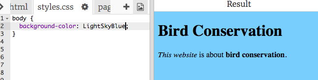
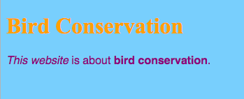

## वेबसाइट का रूप नियंत्रित करना

वह कोड जो यह बताये कि वेबसाइट कैसा दिखता है, उसे **CSS** कहते हैं।

- कोड पैनल के शीर्ष पर स्थित टैब को देखें, और `styles.css` नामक फ़ाइल पर क्लिक करे। फ़ाइल में निम्न पाठ(text) है:

```css
  body {
      background-color: white;
  }
```

- `white` रंग को `LightSkyBlue` रंग में बदलो और देखो क्या होता है। आपकी वेबसाइट पर अब नीली पृष्ठभूमि(background) होनी चाहिए!



--- collapse ---
---
title: यह कैसे काम करता है?
---

यदि आप `index.html` फाइल कि शुरुआत में देखते हैं, आपको निम्न पंक्ति दिखाई देगी:

```html
  <link type="text/css" rel="stylesheet" href="styles.css"/>
```

उपरोक्त पंक्ति ब्राउज़र को एक विशेष फ़ाइल की तलाश करने के लिए कहती है जिसका नाम `styles.css` है। इस विशेष फाइल को **स्टाइल शीट (style sheet)** कहा जाता है । आप स्टाइल शीट के नाम में `.css` द्वारा फ़ाइल पहचान सकते हैं।

स्टाइल शीट में **नियम** शामिल हैं जो बताते हैं आपके वेबसाइट के प्रत्येक तत्व(element) को कैसा दिखना चाहिए।

घुंघराले ब्रेसिज़(curly braces) `{ }` और उनके बीच का कोड **CSS नियमों** का एक समूह है । शब्द `body` का मतलब है की नियम आपकी वेबसाइट पर सभी `<body>` तत्व(elements) के लिए है। घुंघराले ब्रेसिज़(curly braces) के सामने वाले भाग को **सिलेक्टर (selector)** कहते हैं । तो इस मामले में, यह बॉडी(body) के तत्वों(elements) के लिए सिलेक्टर (चयनकर्ता) है।

घुंघराले ब्रेस(curly braces) के अंदर प्रत्येक नियम निम्न से बना है:
  - बाईं ओर **प्रॉपर्टी (property)**, इसके बाद एक बृहदान्त्र प्रतीक(colon symbol) `:`
  - बृहदान्त्र(colon) के बाद दाईं ओर प्रॉपर्टी का **मान(value)**
  - अतं में एक अर्ध-औपनिवेशिक प्रतीक(semi-colon symbol) `;`

--- /collapse ---

- चलो पाठ(text) का रुप बदलने के लिए नियम जोड़ते हैं। घुंघराले ब्रेसिज़(curly braces) के अंदर दो नई पंक्तियाँ जोड़ें:

```css
  body {
    background-color: LightSkyBlue;
    font-family: "Helvetica", sans-serif;
    color: purple;
  }
```

+ देखें कि इसने वेबसाइट को कैसे बदल दिया है।

`color` प्रॉपर्टी(property) हमेशा पाठ(text) के लिए होती है। यहां, आप अपने वेबपेज पर `body` पाठ(text) का रंग सेट कर रहे हैं।

- आप शीर्षकों(headings) और अनुच्छेदों(paragraphs) के लिए अलग-अलग नियम भी लिख सकते हैं। `<h1>` शीर्षकों(headings) के लिए, आप `h1` चयनकर्ता का उपयोग करते हैं । बॉडी(body) के लिए CSS नियम वाले घुंघराले ब्रेसस(curly brace) के नीचे निम्न कोड जोड़ें।

```css
  h1 {
    color: orange;
    font-family: "Times New Roman", serif;
  }
```

आपका शीर्षक(heading) नारंगी रंग का होना चाहिए जबकि आपका अनुच्छेद(paragraph) पहले की तरह बैंगनी रंग होना चाहिए।



ध्यान दें कि कैसे अक्षर भी एक अलग रंग होने के साथ-साथ अलग दिख भी रहे हैं? ऐसा इसलिए है क्योंकि आपने उनके **फ़ॉन्ट परिवार (font family)** को बदल दिए हैं। आप [यहां](http://dojo.soy/se-font-families) कुछ और फ़ॉन्ट(fonts) पा सकते हैं।

- `h2` चयनकर्ता का उपयोग करके `<h2>` शीर्षकों(headings) के लिए नियमों का एक सेट जोड़ने का प्रयास करें।

- पाठ(text) और पृष्ठभूमि(background) के लिए अलग-अलग रंग संयोजनों के साथ प्रयोग करने का प्रयास करें? उपयोग करने के लिए बहुत सारे रंग उपलब्ध हैं। उनकी पूरी सूची का पता [यहाँ](http://dojo.soy/se-color-names) लगाएं।
