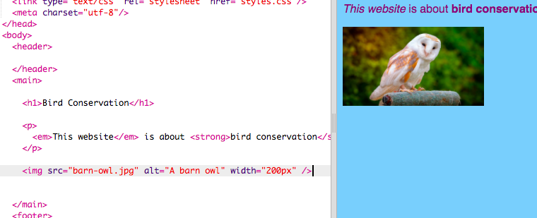

## चित्र जोड़ना

चलो एक तस्वीर जोड़ते हैं!

- `index.html` नाम के टैब पर जाएं। `</main>` टैग(tag) खोजें और यह उसके **ऊपर** टाइप करें:

```html
    
```

परिणाम ऐसा दिखना चाहिए:



ध्यान दें कि इस टैग(tag) के अंदर अतिरिक्त जानकारी है। उन्हें **ऐट्रिब्यूट्स (attributes)** कहा जाता है ।

- कोड में `width="200px"` ढूंढें और विभिन्न संख्याओं के साथ प्रयोग करके देखें ताकि आप यह पता लगा सकते हैं कि यह ऐट्रिब्यूट(attribute) क्या करता है। `px` अक्षर न हटाएं!

--- collapse ---
---
title: img टैग कैसे काम करता है
---

ध्यान दें कि `` टैग(tag) आपके द्वारा अब तक उपयोग किए गए अन्य टैग(tag) से अलग है - इसमें कोई बंद करने वाला ` </img>` टैग नहीं है। इसके बजाय, यह टैग **स्व-समापन है**: इसके अंत में ` />` है। इसका कारण यह है कि छवि तत्व(element) का कोई 'प्रारंभ' और 'अंत' नहीं है, जैसे पृष्ठ पर पाठ(text) के लिए होता है।

टैग(tag) **ऐट्रिब्यूट्स(attributes)** में अतिरिक्त जानकारी रखता है:
- `src` ऐट्रिब्यूट(attribute) ब्राउज़र को बताती है कि चित्र के लिए किस फ़ाइल का उपयोग करना है।
- `alt` ऐट्रिब्यूट(attribute) एक संक्षिप्त विवरण है जो ब्राउज़र पर दिखेगा अगर वह चित्र प्रदर्शित नहीं हो पाया। 'ऑल्ट (alt)' का पूर्ण रूप 'अल्टरनेटिव' है जिसका मतलब विकल्प होता है। यह पाठ(text) स्क्रीन रीडर का उपयोग करने वाले लोगों को यह जानने में भी मदद करता है कि चित्र क्या है।
- `width`ऐट्रिब्यूट ब्राउज़र को बताती है कि चित्र को कितना चौड़ा बनाना है। `100px` का मतलब है एक सौ **पिक्सेल (pixels)**, जो छोटे बिंदु हैं जो मिलकर आपके स्क्रीन पर जो कुछ दिखाई देता है वो बनाते हैं। यदि आप इस ऐट्रिब्यूट को शामिल नहीं करते हैं, तो चित्र को उसके मूल आकार में प्रदर्शित किया जाएगा।

--- /collapse ---

अब जब आप अपनी वेबसाइट पर एक तस्वीर डालने के लिए कोड जानते हैं, तो आप शायद तस्वीर बदलना चाहते हैं, है ना?

- निश्चित रूप से पहली चीज जो आपको चाहिए होगी वो है, एक तस्वीर! आप अपने कंप्यूटर पर पहले से मौजूद एक तस्वीर का उपयोग कर सकते हैं, जैसे कि आपके द्वारा लिया गया फोटोग्राफ, या आप इंटरनेट से प्राप्त कर सकते हैं।

[[[generic-get-picture-from-web]]]

** ध्यान दें:** सभी तस्वीरें जो इंटरनेट पर मिलती हैं वो सब के उपयोग के लिए नि: शुल्क नहीं है। यदि आप कोई चित्र डाउनलोड करते हैं, तो आपको यह सुनिश्चित करना चाहिए की उसे आपको उपयोग करने की अनुमति है। इसके बारे में यहाँ और अधिक जानकारी प्राप्त करें:

[[[images-permissions-to-use]]]

जब आपके पास एक चित्र हो, तो आप Trinket पर फ़ाइल **अपलोड(upload)** कर सकते हैं।

- अपने trinket में,** + ** के बगल में **image** चिह्न पर क्लिक करें।


यह वह जगह है जहाँ आप उन चित्रों को देख सकते हैं जिन्हें आप अपनी वेबसाइट पर उपयोग कर सकते हैं। आपको चीखने वाला उल्लू(barn owl) की तस्वीर दिखनी चाहिए।

- **Add Image** बटन पर क्लिक करें और फिर **Upload** पर क्लिक करें ।

- **Click To Select Files** बटन पर क्लिक करें । खुलने वाली विंडो में अपनी तस्वीर वाली फ़ाइल ढूंढें और डबल क्लिक करें।

- **Done** बटन पर क्लिक करें।


अब आपकी तस्वीर अपलोड(upload) की जाएगी और उपयोग करने के लिए तैयार हो जाएगी।

- `index.html` फ़ाइल में जाएँ और `` टैग ढूंढें। `barn-owl.jpg` को बदलें ताकि यह आपके द्वारा चुनी गई तसवीर वाली फ़ाइल के नाम से पूरी तरह मेल खाता हो। ध्यान दें कि इसका नाम `.jpg` में समाप्त हो सकता है बजाय `.png`!

आपके द्वारा अभी-अभी बदला गया टेक्स्ट(text) `src` नामक एट्रिब्यूट(attribute) है, जो ब्राउज़र को बताता है कि किस फ़ाइल को प्रदर्शित करना है।

**ध्यान दें:** किसी एट्रिब्यूट(attribute) के लिए आपके द्वारा टाइप की गई वैल्यू (value) उद्धरण चिह्न `" "` के अंदर होनी चाहिए!

--- challenge ---

## चुनौती: चित्र का alt पाठ(text) बदलें

- आपकी चित्र तत्व(element) के `alt` ऐट्रिब्यूट(attribute) को खोजें और text को बदल कर उसमें अपने चित्र का संक्षिप्त विवरण लिखिये।

--- /challenge ---


