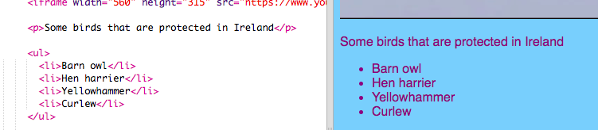
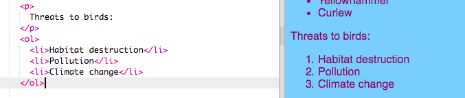

## सूची बनाना

अब आप सीखेंगे कि वस्तुओं की सूची, जैसे कि "गेंडा, रोबोट, बिल्लियाँ" को एक अच्छे दिखने वाले सूची में कैसे बदल सकते हैं, जिसे आप बाद में और आकर्षक बना सकते हैं।

- `index.html` फ़ाइल में, `</main>` वाली लाइन के ठीक ऊपर निम्न कोड जोड़ें:

```html
    <ul>
        <li>Barn owl</li>
        <li>Hen harrier</li>
        <li>Yellowhammer</li>
        <li>Curlew</li>
    </ul>
```

परिणाम इस तरह से एक अच्छी सूची होनी चाहिए:



ध्यान दें कि सूची में प्रत्येक वस्तु के आसपास `<li></li>` टैग अलग अलग से जोड़ी है ।

यह आयरलैंड में कुछ संरक्षित पक्षियों की एक सूची है। आप सूची में वस्तुओं को अपनी वेबसाइट के अनुसार बदल सकते हैं, और अगर आप चाहें सूची में ऊपर वर्णन के लिए एक अनुच्छेद(paragraph) भी जोड़ सकते हैं!

अगर आप एक संख्यांकित सूची चाहते हैं तो वह कैसे बनाएंगे? यह लगभग समान है, लेकिन `<ul>` के बजाय, आप `<ol>` का उपयोग करते हैं। एक संख्यांकित सूची को एक **क्रमबद्ध(ordered)** सूची भी कहा जाता है।

- आपके द्वारा लिखे गए कोड के नीचे निम्नलिखित कोड जोड़ें - सुनिश्चित करें कि यह `</ul>` टैग के **नीचे** है!

```html
    <p>
        Threats to birds:
    </p>
    <ol>
        <li>Habitat destruction</li>
        <li>Pollution</li>
        <li>Climate change</li>
    </ol>
```

यहाँ अब यह ऐसा दिखना चाहिए:



--- challenge ---

## चुनौती: अपनी सूचियों में शैली(style) जोड़ें

- देखें की क्या आप सूचियों का रूप बदलने के लिए अपनी स्टाइलशीट में **CSS** नियम जोड़ सकते हैं?

--- /challenge ---
