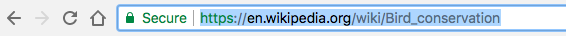
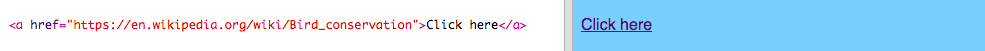
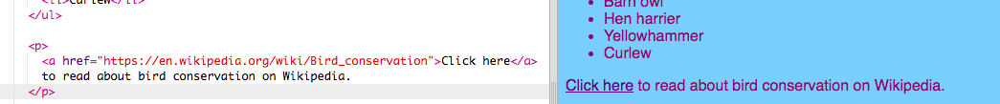

## लिंक बनाना

इस कार्ड पर आप सीखेंगे कि एक लिंक(link) कैसे बनाया जाता है जो क्लिक करने पर आपको दूसरे पृष्ठ पर ले जाये।

- निम्न कोड को `index.html` के मुख्य भाग में जोड़ें:

```html
  <a href="">Click here</a>
```

`<a> </a>` टैग(tag) उनके बीच लिखे पाठ(text) को लिंक में परिवर्तित कर देते हैं।

- अपने लिंक(link) पर क्लिक करके देखें की क्या होता है। यह कुछ नहीं करता है, है ना?

ऐसा इसलिए है क्योंकि `href` एट्रिब्यूट(attribute) फिलहाल खाली है। इसमें **URL** (पृष्ठ का वेब पता(web address)) जिसे आप लिंक(link) करना चाहते हैं होना आवश्यक है।

- विकिपीडिया पर जाएँ और अपनी वेबसाइट पर किसी चीज़ के बारे में एक पृष्ठ खोजें। मैं पक्षी संरक्षण के बारे में पृष्ठ का उपयोग करने जा रहा हूं।

- एड्रेस बार(address bar) में क्लिक करें और उसमें सभी टेक्स्ट(text) को चुनें। आप जिस पृष्ठ पर हैं, उसका यह पूरा URL है। दबाएं <kdb>Ctrl</kdb> (या <kdb>cmd</kdb>) तथा <kdb>C</kdb> चाबियाँ(कीबोर्ड के बटन) एक ही समय में इसे कॉपी करने के लिए।

  

- अपनी trinket में, `href =` के बाद उद्धरण चिह्नों(quotation marks) के बीच क्लिक करें और दबाएं <kdb>Ctrl</kdb> (या <kdb>cmd</kdb>) तथा <kdb>V</kdb> key (कीबोर्ड के बटन) एक साथ ताकि आपके द्वारा कॉपी किए गए URL वहां पेस्ट हो जाये। आपका कोड कुछ इस तरह दिखना चाहिए:

```html
  <a href="https://en.wikipedia.org/wiki/Bird_conservation">Click here</a>
```

आपने अभी अपना पहला लिंक बनाया है! इस पर क्लिक करें देखें कि क्या यह अब काम करता है।



--- collapse ---
---
title: अन्य वेबसाइटों के लिए लिंक
---

कुछ वेब पृष्ठ के साथ काम करने में trinket को परेशानी होती है। आप चाहें तो विकिपीडिया के अलावा अन्य वेबसाइटों के URL आज़मा सकते हैं, लेकिन हो सकता है कि वे आपके trinket में काम न करें। हालाँकि, यदि आप अपने प्रोजेक्ट को डाउनलोड करें और वेब ब्राउज़र में फ़ाइलों को देखें, तो आपको लिंक काम करते हुए दिखाई देंगे।

--- /collapse ---

- `<a> </a>` टैग(tag) के बीच शब्दों के बजाय चित्र लगाने का प्रयास करें `यहां क्लिक करें`, इस तरह:

```html
  <a href="https://en.wikipedia.org/wiki/Bird_conservation">
      
  </a>
```

- अपने चित्र पर क्लिक करें। क्या यह एक लिंक में बदल गया है?

आप अपने वेबपेज के अन्य तत्वों(elements) में भी लिंक डाल सकते हैं, जैसे कि एक अनुच्छेद(paragraph) में या एक सूची में भी। यहाँ एक वाक्य के साथ लिंक का उदाहरण दिया गया है:

```html
  <p>
    <a href="https://en.wikipedia.org/wiki/Bird_conservation">Click here</a> to read about bird conservation on Wikipedia.
  </p>
```



--- challenge ---

## चुनौती: एक सूची में एक लिंक डालिये

- क्या आप एक सूची बना सकते हैं जिसमें किसी एक सूची वस्तु के अंदर एक लिंक है।

--- hints ---

--- hint ---

सूची आइटम चालू करने के लिए `<li> </li>` एक लिंक में, लिंक टैग की एक जोड़ी के बीच सूची टैग सहित, यह सब डाल दिया `<a> </a>` और `href` एट्रिब्यूट(attribute) जोड़ें जैसा कि आपने ऊपर किया है।

--- /hint ---

--- hint ---

निम्नलिखित सूची में, 'Hen harrier' सूची आइटम को लिंक में बदल दिया गया है।

```html
    <ul>
        <li>Barn owl</li>
        <a href="https://en.wikipedia.org/wiki/Hen_harrier"><li>Hen harrier</li></a>
        <li>Yellowhammer</li>
        <li>Curlew</li>
    </ul>
```

--- /hint ---

--- /hints ---


--- /challenge ---


