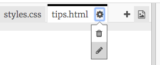

## और पृष्ठ जोड़ना

यह कार्ड आपको दिखाएगा कि आपकी वेबसाइट पर और पृष्ठ कैसे जोड़े जाएं।

- कोड पैनल के शीर्ष पर, टैब के आगे **+** चिन्ह पर क्लिक करें, और अपनी नई फ़ाइल के लिए एक नाम लिखें। इसे `.html` (डॉट सहित!) में समाप्त होना चाहिए ताकि ब्राउज़र को पता हो कि यह एक वेबपेज है।


--- collapse ---
---
title: फ़ाइल का नाम बदलना या हटाना
---

यदि आप किसी फ़ाइल का नाम बदलना चाहते हैं, तो फ़ाइल नाम के दाईं ओर **cog** चिन्ह पर क्लिक करें, और फिर **पेंसिल(pencil)** चिन्ह पर क्लिक करें । नए नाम में टाइप करें और **Enter** दबाएं। आप **पेंसिल(pencil)** चिन्ह के बजाय **bin** चिन्ह पर क्लिक करके फ़ाइल हटा भी सकते हैं। 

आप सोच रहे होंगे कि आप `index.html` फ़ाइल का नाम क्यों नहीं बदल सकते। `index.html` एक वेबसाइट की **मुखपृष्ठ(homepage)** के लिए प्रयुक्त एक विशेष नाम है | जब आप किसी वेबसाइट पर जाते हैं तो वह पहला पृष्ठ होता है। जब भी आप किसी वेबसाइट के मुखपृष्ठ(homepage) पर जाते हैं, तो ब्राउज़र `index.html` नामक फ़ाइल की तलाश करता है और इसे आपकी स्क्रीन पर प्रदर्शित करता है।

--- /collapse ---

- `blank_page.html` फ़ाइल ढूंढें और इसके सभी कोड अपनी नई फ़ाइल में कॉपी और पेस्ट(paste) करें। क्यूंकि आप पूरे कोड की प्रतिलिपि बनाना चाहते है, कोड को एक बार में चुनने के लिए कोड पर कहीं भी क्लिक कर सकते हैं और कीबोर्ड शॉर्टकट <kbd>Ctrl</kbd> (या <kbd>cmd</kbd>) और <kbd>A</kbd> का उपयोग कर सकते हैं ।

- आपके नए पृष्ठ को उपयुक्त शीर्षक देने के लिए `<title> </title>` टैग के बीच के पाठ(text) बदलें। Trinket शीर्षक प्रदर्शित नहीं करेगा, लेकिन यदि आप अपना प्रोजेक्ट डाउनलोड करते हैं तो आप इसे अपने ब्राउज़र विंडो के शीर्ष(top) पर देख सकते हैं।


- नई फ़ाइल में `<main> </main>` टैग(tag) बीच में, उन टैग(tag) का उपयोग करें जिनके बारे में आपने सीखा है, जैसे अनुच्छेद(paragraph), शीर्षक(heading), छवि(image) और सूची(list)!

- प्रत्येक नए पृष्ठ के लिए ऊपर दिए गए चरणों को दोहराएँ।

जब trinket में एक साथ दिखाने के लिए बहुत सारे टैब हो जाते हैं, तो आप उनके बीच स्क्रॉल करने के लिए टैब के ऊपरी बाएं कोने में स्थित **<** और **>** चिन्हों का उपयोग कर सकते हैं।


अब आपको लिंक बनाने की आवश्यकता है ताकि आप अपने प्रत्येक नए पृष्ट तक पहुंच सकें! चलिए सभी लिंक एक सूची में डालते हैं।

- `index.html` फ़ाइल में, निम्नलिखित कोड अपने वेबपृष्ठ के मुख्य भाग में जोड़ें:

```html
    <ul>
        <li><a href="index.html">Home</a></li>
        <li><a href="birds.html">Protected Birds</a></li>
        <li><a href="conservation.html">Conservation</a></li>
        <li><a href="sanctuaries.html">Bird Sanctuaries</a></li>
    </ul>
```

- प्रत्येक लिंक के लिए `href` एट्रिब्यूट(attribute) का मान(value) बदलें (याद रखें, यह उद्धरण चिह्नों के अंदर का पाठ(text) है) ताकि यह आपके द्वारा बनाई गई प्रत्येक HTML फ़ाइल के नाम से बिल्कुल मेल खाता हो।

- आपके पृष्ठों के उपयुक्त विवरण के लिए `<a> </a>` टैग के बीच के पाठ को बदलें।

अब आप अपने नए पृष्ठों पर जा सकते हैं!


